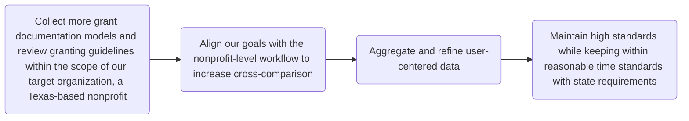

# Audit Charts

| **Further Steps**|
| :--- | 
| - Collect more grant documentation models and review granting guidelines within the scope of our target organization, a Texas-based nonprofit| 
| - Align our goals with the nonprofit-level workflow to increase cross-comparison| 
| - Aggregate and refine user-centered data| 
| - Maintain high standards while keeping within reasonable time standards with state requirements | 
| **Materials** | 
| - GitHub |
| - Open Technical Communication textbook |
| - Online Research |
| - Reviewing Previous guides |
| - Texas State University Library |
| **Documentation** | 
| We will publish documentation stages on GitHub to provide collaboration across project workflows |
| **Editing/Changing Content** | 
| Will be decided as a team. |

## **Process**

| Organizational Information | Proposal Details | Budget Information |
| :--- | :---: | ---: |
| The organizational section will review the applicant's history, overarching goals, current programs, and internal structure, including board, staff, and volunteer demographics.|The proposal section will review the project, outlining the community need, planned activities, targeted goals, and evaluation metrics. | The guide concludes with the financial framework, detailing the required budget information to support the request. |

## **Further Steps Flow Chart**

## **Audit Summary/Content Issues**

Our current context organization is a generalized grant application formatting document that labels the essential components of the grant application with short descriptions. We are missing more contextual documents to provide a variety of perspectives to refine our final documentation. The inconsistencies present include an unstructured reference documentation guide as well as a lack of current standards related to our “target” organization. A variety of documentation allows us to create a more comprehensive guide and is more user centered. We can improve this by aggregating more data to compose a data-informed document. With state funding requirements, we can incorporate this documentation to further refine our process. Realistically speaking, there are rather consistent changes to grant requirements, but we could establish a document that allows for regular updates.
