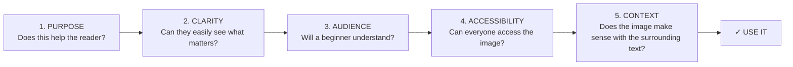

# Design System Guide

## Page or Topic Template

This draft template is a possible page or topic template for our team’s grant writing project. It can be adjusted as we refine the final style. Once finalized, the structure can be filled out and applied directly to our website or final document.

### Explanation of Template

- Header & Navigation - first thing visitors will see

- Logo/Project Name: image of the project/name

- Menu Content Buttons: navigation buttons for the website

- Hero

- Title: page title

- Subtitle: if there is another name for the specific content

- Image: possible image tying together the page

- Main Body Content

- Section Heading: Title of the section

- Content: Content of the page

- Image/Audio/Video: dependent on the content; these will complement

- Footer

- Menu Content for Bottom of the page: navigation

- Logo/Project Name: image of the project/name

### Blank Template

Header & Navigation 

Logo/Project Name:

Menu Content Buttons:

Hero

Title:

Subtitle:

Image:

Main Body Content

Section Heading:

Content:

Image/Audio/Video:

Footer

Menu Content for Bottom of the page:

Logo/Project Name:

## Image & Screenshot Rules
### Image & Screenshot Design
- Add images around or near by the surrounding text it supports, or references.
- Refrain from using more than 3 images per section, aim for about 1-3 images.
- Keep image sizes, borders and captions consistent throughout the website. For example, if captions are 12pt Times New Roman, ensure all captions are.
- Images can be about 50% of the content width.
- Use boxes, or arrows to point at specific information within the screenshot or image. 
- Leave white space between the image and text. 
- Include clickable images, if needed.
### Image & Screenshot Content 
- Use images only when they clarify or support the surrounding text.
- If using a pdf, or referencing a longer piece of work, screenshot the specific section you are referring to, if needed.
- Use screenshots to demonstrate where the audience can find important information or complete a task.
-Include descriptive captions under or around the images.
-Remove any confidential or personal information if using screenshots.
### Check For This Before Adding An Image:

## Accessibility Checklist
- All images include descriptive alt text.
- Any charts, figures, or diagrams have detailed descriptions.
- Buttons and links in guide have semantic names.
- Content is structured semantically, linearly, and contains consistent navigation options.
- Information is not conveyed only through color.
- Any use of color is color-blind friendly.
- Text contrast ratio is readable (4.5: for normal text and 3:1 for large text).
- Text can be resized up to twice as big without loss of readability.
- Limit images containing text.
- Content reorganizes into a single column when zoomed in (i.e doesn't require horizontal scrolling)
- Text spacing can be adjusted without hurting content.
- Guide can be operated with use of just a keyboard.
- Navigable links that allow user to skip to content.
- Pages and headings have descriptive and unique titles.
- Guide is set up for auto-translation (i.e page language is marked as English)
- Guide is optimized for mobile viewing.
